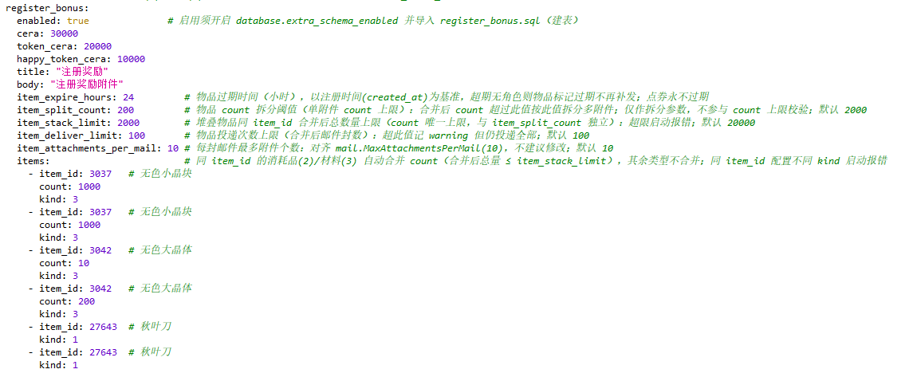
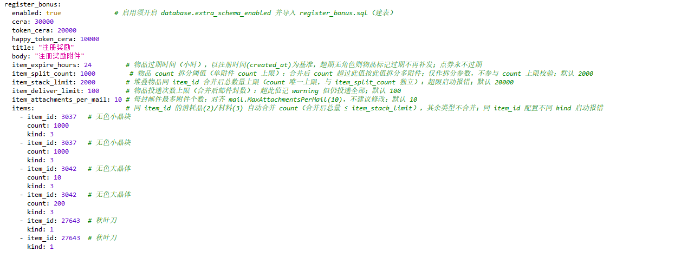
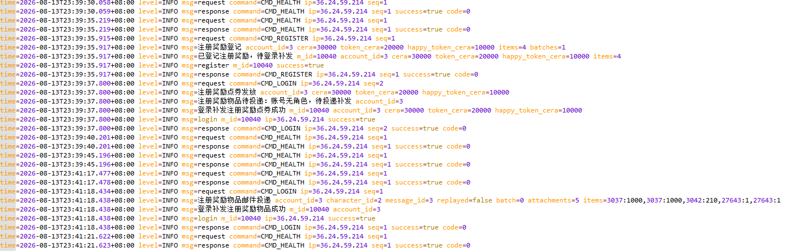
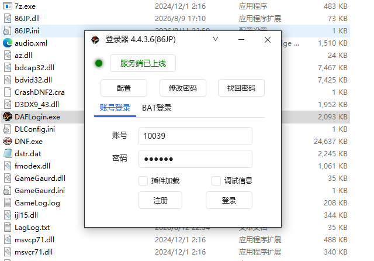
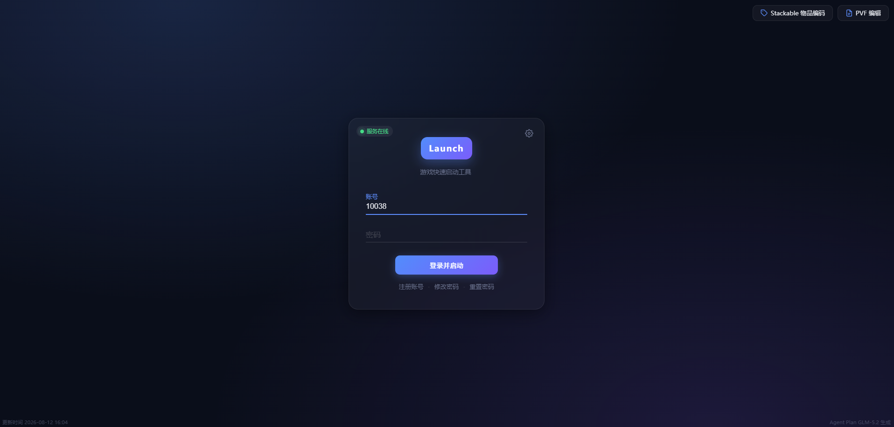
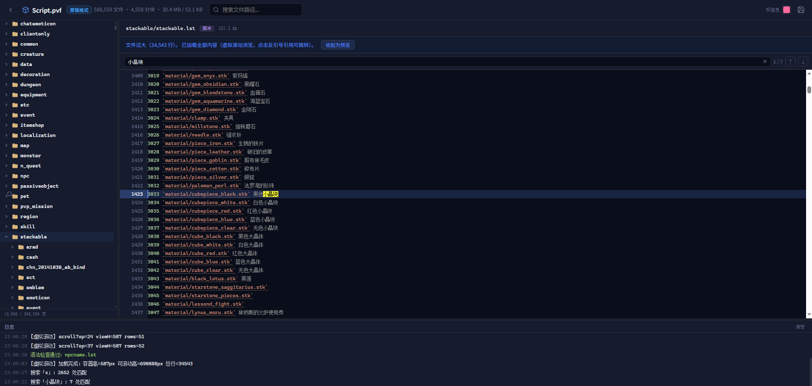
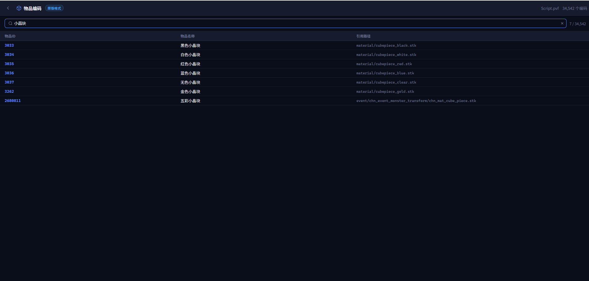
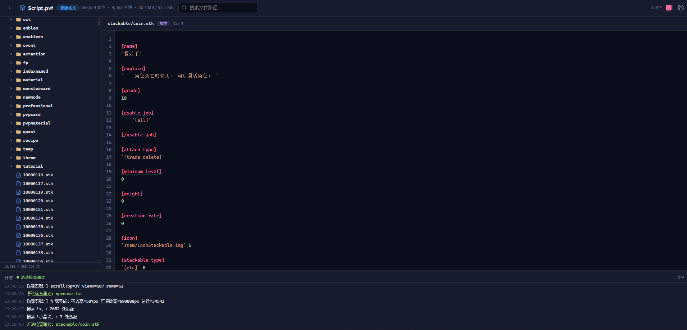

# DAF资源合集
> **免责声明**：本仓库资源及相关文档仅供学习交流使用，下载后请于24小时内删除。使用时必须遵守相关法律法规，严禁用于任何违法、侵权、攻击或恶意用途、严禁任何形式的商业用途。

## [Releases](https://github.com/manydots/resourceHub/releases)

| 资源 | 文档 | 说明 |
|------|----------|------|
| DAFLogin | [DAFLogin/use.md](docs/86JP/DAFLogin/use.md) | 账号注册/登录/改密、BAT登录、插件加载、服务状态检测，使用 Protobuf 对接 Gateway 网关协议 |
| Gateway | [Gateway/deploy.md](docs/86JP/Gateway/deploy.md) | 账号注册/登录/改密/重置/健康检查、限流与鉴权、协议白名单管理、配置注册奖励、内置LaunchHelper网页登录器等|
| LaunchHelper `已开源` | [LaunchHelper网页登录器](https://github.com/manydots/launch-helper) | 通过浏览器自定义协议 `LaunchHelper` 启动 Windows 游戏 |

## [ClientPatch](docs/86JP/ClientPatch)

| 插件 | 作者 | 说明 |
|------|------|------|
| MultiInstance.dll | Agni_Shine | S4A12多开插件 |

## 功能预览

### Gateway网关（注册奖励规则）

- **注册奖励规则1**：注册奖励规则配置，注册奖励点券（cera / token_cera / happy_token_cera）与附件物品
  

- **注册奖励规则1-角色领取1**：角色`重新`登录后通过游戏邮件领取注册奖励
  

- **注册奖励规则1-角色领取2**：角色领取注册奖励（多件物品场景）
  

- **注册奖励规则2**：注册奖励规则配置（另一组规则参数）
  

- **注册奖励规则2-角色领取**：角色`重新`登录后通过游戏邮件领取注册奖励
  

- **注册奖励规则2-日志**：注册奖励补发日志，记录每次登录的补发明细（register_bonus_log）
  

### DAFLogin登录器

- **DAFLogin登录器**：仿`DOFLogin`单机登录器设计，支持账号注册/登录/改密、BAT登录、插件加载与服务状态检测
  

### LaunchHelper 网页登录器

- **网页登录器**：浏览器通过自定义协议 `LaunchHelper` 启动 Windows 游戏
  

- **PVF简单解析**：浏览器在线解析文件，查看解包资源内容
  

- **物品检索**：按关键字检索物品，快速定位目标物品
  

- **点击路径跳转**：点击检索结果，直接跳转到物品所在路径
  

## 项目结构

```
resourceHub/
├── docs/                 # 使用与部署文档
│   └── 86JP/             # 86JP 大区
│       ├── ClientPatch/  # 客户端插件
│       ├── DAFLogin/     # DAFLogin 登录器文档
│       └── Gateway/      # Gateway 网关部署文档
├── other/                # 其他资源
│   ├── IDA Pro 9.1/      # IDA Pro 9.1 资源（0627 / 0725 / 1031）
│   ├── Siroco/           # Siroco 大区文件（frida / home / lib / root / usr）
│   └── 大合集/            # DOF 补丁大合集
├── LICENSE
└── README.md
```

## 其他资源

- [Cloudflare](https://developers.cloudflare.com/warp-client/get-started/windows/)
- [Visual Studio 2022](https://visualstudio.microsoft.com/zh-hans/downloads/)
- [inifile](https://github.com/Gaaagaa/inifile)
